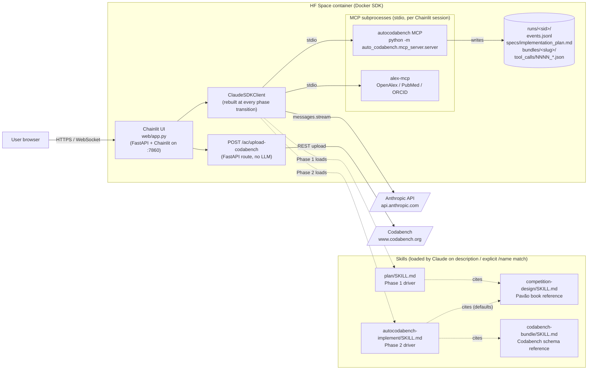
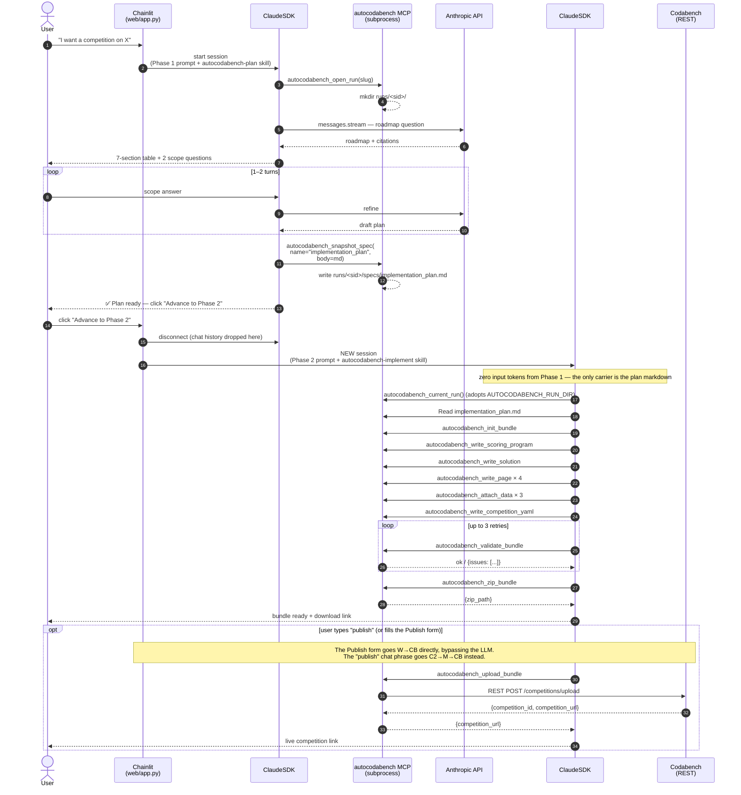

# auto_codabench — package internals

The `auto_codabench` Python package contains the **MCP server**, the
**skills**, and the bundle authoring code. End-user docs live in
[`INSTRUCTION_FOR_USER.md`](./INSTRUCTION_FOR_USER.md); read that
first if you just want to USE the workflow.

This README is for anyone editing the package itself.

---

## Layout

```
auto_codabench/
├── mcp_server/                  # FastMCP 2.x stdio server
│   ├── server.py                # entry point: python -m auto_codabench.mcp_server.server
│   ├── mcp.py                   # the shared FastMCP() instance
│   ├── config.py                # paths + resolve_bundle_dir(slug) (per-session aware)
│   ├── run_log.py               # open_run, current_run, log_event, snapshot_spec,
│   │                            #   logged_tool decorator (full audit trail)
│   ├── bundle_io.py             # pure file-I/O layer; no MCP; importable standalone
│   └── tools/
│       ├── runs.py              # autocodabench_open_run / current_run / log_event / snapshot_spec
│       ├── bundle.py            # init / write_competition_yaml / write_page /
│       │                        #   write_scoring_program / write_ingestion_program /
│       │                        #   write_solution / attach_data
│       ├── package.py           # validate_bundle / zip_bundle
│       └── upload.py            # upload_zip helper (env- OR param-credentials) +
│                                #   autocodabench_upload_bundle MCP wrapper
│
├── skills/
│   ├── plan/SKILL.md                    # Phase 1 — produces specs/implementation_plan.md
│   ├── autocodabench-implement/SKILL.md # Phase 2 — packages the bundle from the plan
│   ├── competition-design/SKILL.md      # reference — Pavão book rules of thumb
│   └── codabench-bundle/SKILL.md        # reference — Codabench bundle schema
│
├── bundles/                     # default global bundles root (gitignored). Per-session
│                                # bundles land at <run>/bundles/<slug>/ instead.
└── runs/                        # per-session run directories (gitignored).
    └── LATEST                   # symlink to the most recent run
```

---

## Key invariants

- **Per-session isolation.** `resolve_bundle_dir(slug)` defaults to
  `<AUTOCODABENCH_RUN_DIR>/bundles/<slug>/` when the env var is set
  (every web session sets it). The global
  `auto_codabench/bundles/<slug>/` is the fallback for CLI usage
  outside any active run. Two concurrent web sessions can't collide.
- **Run-dir adoption.** `current_run()` adopts `AUTOCODABENCH_RUN_DIR`
  on first call when `_current_run` is None — so a fresh MCP
  subprocess (spawned on every web phase transition) reliably
  resolves to its parent's session, not to the global `runs/LATEST`
  symlink.
- **Every tool call is captured.** `logged_tool(name)` in `run_log.py`
  wraps each `@mcp.tool` so the request + response + duration land
  under `<run>/tool_calls/NNNN_<tool>.json` + a one-liner in
  `<run>/events.jsonl`.

---

## System diagrams

These are the canonical pictures of how the pieces fit together. If
you're editing the package, start here.

### Runtime architecture

What runs where during a live web session.



Key things this picture encodes:

- **One ClaudeSDKClient per phase**, not per session. The phase
  transition disconnects the SDK and stands up a fresh one with a
  new system prompt and tool allowlist. The Phase 1 chat history is
  dropped at that point — only the locked plan markdown carries
  forward.
- **Two MCP subprocesses per Chainlit session**: `autocodabench` (the
  bundle authoring tools, defined in this package) and `alex-mcp` (a
  third-party OpenAlex/ORCID lookup tool, installed via
  `git+https://github.com/drAbreu/alex-mcp.git@v4.8.2`).
- **The run directory is the persistence boundary.** Everything that
  needs to outlive the agent (events, tool-call audit, plan,
  bundle) lives at `runs/<sid>/`. The MCP server is the only writer.
- **Codabench upload doesn't go through the LLM.** The Publish form
  in the workspace panel POSTs to `/ac/upload-codabench`, which calls
  the REST API directly. The `autocodabench_upload_bundle` MCP tool
  exists as a CLI alternative — see
  [`autocodabench-implement/README.md` §"Upload only on explicit user request"](skills/autocodabench-implement/README.md#design-rationale).
- **Skills are not always loaded.** Claude indexes the `description:`
  frontmatter of every available skill and loads matching ones on
  intent (or when the user types `/<skill-name>` explicitly). The
  driver skills (plan, autocodabench-implement) cite the knowledge
  skills (competition-design, codabench-bundle) — each
  per-skill README documents the citation map.

### Phase 1 → Phase 2 session sequence

What a single end-to-end web session looks like, with the cost-saving
phase reset visible.



The diagrams above are kept here (rather than in the root README)
because every link in them is a path inside this package — they read
naturally from this directory.

---

## MCP tools

14 tools total. The web app's allowlist exposes a subset per phase
(see `web/app.py:_TOOLS_BY_PHASE`).

### Run + logging

| Tool                            | Used by              | What it does                                           |
| ------------------------------- | -------------------- | ------------------------------------------------------ |
| `autocodabench_open_run`        | Phase 1 (web), CLI   | Create or adopt a run dir; route subsequent logs there |
| `autocodabench_current_run`     | Both phases          | Return active run path (`{opened: bool, path}`)        |
| `autocodabench_log_event`       | Both phases          | Append a structured event to `events.jsonl`            |
| `autocodabench_snapshot_spec`   | Phase 1 only         | Write `<run>/specs/<name>.md` + versioned copy         |

### Bundle authoring (Phase 2)

| Tool                                      | What it does                                                  |
| ----------------------------------------- | ------------------------------------------------------------- |
| `autocodabench_init_bundle`               | Create `<run>/bundles/<slug>/` skeleton                       |
| `autocodabench_write_competition_yaml`    | The master `competition.yaml`                                 |
| `autocodabench_write_page`                | One of `overview.md` / `evaluation.md` / `terms.md` / `data.md` |
| `autocodabench_write_scoring_program`     | `scoring_program/score.py` + `metadata.yaml`                  |
| `autocodabench_write_ingestion_program`   | (Only for γ code-submission competitions)                     |
| `autocodabench_write_solution`            | `solution/sample_code_submission/model.py` + sample data      |
| `autocodabench_attach_data`               | `reference_data` / `input_data` / `public_data`               |
| `autocodabench_validate_bundle`           | Schema lint — always run before zipping                       |
| `autocodabench_zip_bundle`                | Produces `<run>/bundles/<slug>/<slug>.zip`                    |
| `autocodabench_upload_bundle`             | Optional — publishes the zip to Codabench via REST API        |

---

## Install + wire-up (for editing the package)

```bash
# from repo root
conda create -n semantic-scholar --clone base -y
conda activate semantic-scholar
pip install -e .
pip install "git+https://github.com/drAbreu/alex-mcp.git@v4.8.2"
```

Sanity-check the data layer (creates a tiny demo bundle in a tempdir,
no MCP, no Claude):

```bash
python -m auto_codabench.mcp_server.bundle_io
# expect: { "ok": true, "issues": [] ... } then a zip_path line
```

Sanity-check the MCP server boots (it will hang on stdin — that's
correct; Ctrl-C to exit):

```bash
python -m auto_codabench.mcp_server.server
```

In-process tool-count check (14 tools):

```bash
python - <<'PY'
import asyncio
from fastmcp import Client
from auto_codabench.mcp_server.mcp import mcp
from auto_codabench.mcp_server import tools  # noqa: F401 — registers tools

async def main():
    async with Client(mcp) as c:
        ts = await c.list_tools()
        print(f"OK: {len(ts)} autocodabench tools available")
        for t in ts:
            print(" -", t.name)

asyncio.run(main())
PY
```

---

## Wire into Claude (CLI)

See [`INSTRUCTION_FOR_USER.md` §B.3](./INSTRUCTION_FOR_USER.md#b3-wire-the-mcp-servers-into-claude).

Both `claude mcp add` (Claude Code) and the
`claude_desktop_config.json` JSON form work; the underlying contract
is just "run `python -m auto_codabench.mcp_server.server` on stdio".

---

## Skills

The skill files in `skills/*/SKILL.md` are Markdown with YAML
frontmatter (`name`, `description`). Claude loads them when the
description matches user intent, or when the user types
`/<skill-name>` explicitly.

There are two **driver** skills (orchestration) and two **knowledge**
skills (reference). Each has a sibling `README.md` next to its
`SKILL.md` documenting provenance and design rationale — read those
when you're editing the skill.

| Skill | Kind | Source | README |
|-------|------|--------|--------|
| `autocodabench-plan`      | driver (Phase 1) | derived (sequencer over competition-design) | [`skills/plan/README.md`](skills/plan/README.md) |
| `autocodabench-implement` | driver (Phase 2) | derived (sequencer over codabench-bundle)   | [`skills/autocodabench-implement/README.md`](skills/autocodabench-implement/README.md) |
| `competition-design`      | knowledge        | [Pavão et al. (2024) *AI Competitions and Benchmarks*][book] | [`skills/competition-design/README.md`](skills/competition-design/README.md) |
| `codabench-bundle`        | knowledge        | [Codabench docs (develop branch)][cbdocs]                    | [`skills/codabench-bundle/README.md`](skills/codabench-bundle/README.md) |

[book]: https://ai-competitions-book.github.io/ai-competitions-book-full-project.pdf
[cbdocs]: https://github.com/codalab/codabench/tree/develop/documentation

The drivers orchestrate; the knowledge skills are quoted. See the
runtime architecture diagram above for which loads which.

For Claude Code project-scoped skills, drop them under
`.claude/skills/`. For globally-available skills, symlink into
`~/.claude/skills/` (the user guide shows the exact commands).

---

## Out of scope (deliberately)

- Codabench upload UI lives in the **web** app
  (`web/app.py:/ac/upload-codabench` FastAPI route), not in this
  package. The MCP `autocodabench_upload_bundle` tool exists as a
  CLI alternative.
- The notebook-based 3-phase flow lives on
  `try-web-ui-with-starting-kit` if we ever want to revive it.
- No Codabench compute-worker setup, no Docker images for scoring,
  no queue config. `validate_bundle` is the strongest local
  guarantee.
