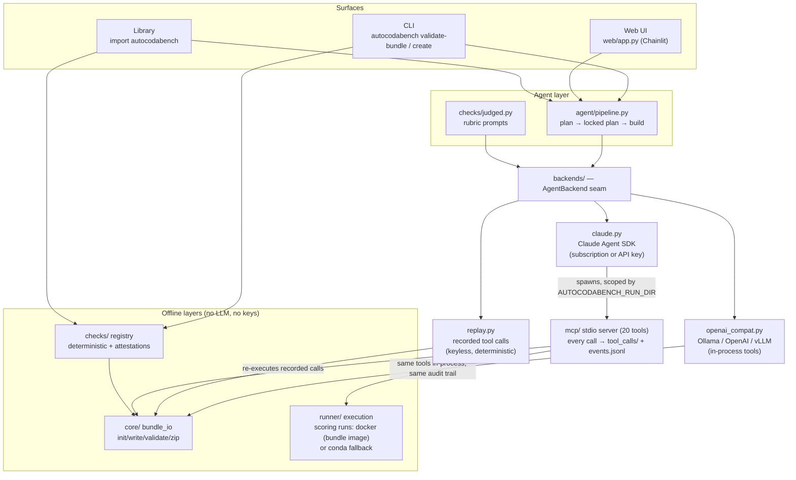

# autocodabench — Architecture

This document is a maintainer- and reviewer-oriented map of `src/autocodabench/`, intended for readers working with the source. End-user documentation is provided in [`INSTRUCTION_FOR_USER.md`](./INSTRUCTION_FOR_USER.md), which is the appropriate starting point for readers who only wish to use the tool. Readers encountering the architecture for the first time may prefer [`design-rationale.md`](./design-rationale.md), which derives the structure mapped here from the failures of simpler designs.

---

## 1. Overview

autocodabench decomposes competition authoring into a **plan** phase and a **build** phase, executed by independent agent sessions that communicate only through a human-reviewable plan document. Agents act exclusively through a surface of typed MCP tools, so every authoring action is logged and replayable. Beneath the agent layer, a pure bundle-I/O core and an offline check framework operate without LLM or network access and are unit-tested conventionally. Generated (or hand-written) competitions are validated by registered checks in three tiers — deterministic gates, LLM-judged advisories, and human attestations — each carrying a citation to its source. Model access is isolated behind a single backend seam comprising the Claude Agent SDK, a generic OpenAI-compatible tool-calling loop (Ollama local models, or any chat-completions endpoint), and record/replay. Consequently, the full pipeline runs deterministically without API keys, and the model backbone itself is a measured experimental variable (`experiments/backbone_bench/`).

---

## 2. Package layout

The package is organized as follows.

```
src/autocodabench/
├── __init__.py              # public facade: create(), validate(), __version__
├── auth.py                  # subscription-vs-API-key status + probe
├── run_log.py               # run dirs, events.jsonl, tool_calls/ snapshots,
│                            #   logged_tool decorator (full audit trail)
├── run_log_hook.py          # Claude Code hook: mirrors transcripts into runs
│
├── core/                    # PURE: no LLM, no network, no MCP
│   ├── config.py            # path resolution (workspace/bundles/runs roots)
│   └── bundle_io.py         # init/write/attach/validate/zip on dicts + files
│
├── runner/                  # runtime counterpart of core
│   └── execution.py         # ingestion/scoring execution; two engines:
│                            #   docker (bundle's docker_image, as the
│                            #   platform runs it) + conda fallback;
│                            #   notebook execution; live-tee'd logs
│
├── checks/                  # the validation framework
│   ├── base.py              # Check / CheckResult / CheckContext / registry
│   ├── facts.py             # competition_facts.yaml (declare-then-verify)
│   ├── deterministic.py     # code-computed gates + findings
│   ├── judged.py            # LLM-graded advisory checks (via backends)
│   ├── attestations.py      # human-only launch criteria
│   ├── report.py            # ValidationReport (dict + markdown)
│   └── api.py               # validate_bundle_path(dir-or-zip)
│
├── backends/                # the model-runtime seam
│   ├── base.py              # AgentBackend protocol, AgentTask, AgentRunResult
│   ├── claude.py            # live: Claude Agent SDK (lazy import)
│   ├── openai_compat.py     # live: any OpenAI-compatible endpoint (Ollama,
│   │                        #   OpenAI, vLLM, …) — stdlib tool-calling loop
│   ├── local_tools.py       # in-process tool registry for generic backends
│   │                        #   (same names + same audit trail as the MCP layer)
│   ├── replay.py            # keyless: re-execute a recorded run's tool calls
│   └── fixtures/            # shipped demo fixture (see scripts/make_demo_fixture.py)
│
├── agent/                   # the plan→build pipeline
│   ├── prompts.py           # skill bodies + per-surface runtime footers
│   └── pipeline.py          # create(): two sessions joined by the locked plan
│
├── mcp/                     # ONE interface over core+runner (FastMCP stdio)
│   ├── instance.py          # the shared FastMCP() object
│   ├── server.py            # python -m autocodabench.mcp.server
│   └── tools/               # 20 thin @mcp.tool wrappers, all @logged_tool
│
├── upload/                  # Codabench REST upload (no LLM)
│   ├── codabench_api.py     # canonical 4-step flow (token→placeholder→PUT→poll)
│   └── service.py           # upload_zip() used by MCP tool + web route
│
├── cli/main.py              # autocodabench {validate-bundle,demo,create,
│                            #   auth,checks}  (validate = back-compat alias)
└── skills/                  # versioned behavioral contracts per phase
    └── <name>/SKILL.md      #   (+ README.md documenting provenance)
```

---

## 3. Design rationale

The following table summarizes the principal design decisions, the principle each embodies, and the rationale behind it.

| Component | Design principle | Rationale |
|---|---|---|
| Twenty small MCP tools rather than a single monolithic operation | Narrow interface / capability boundary | The agent can act only through typed, logged operations; the tool trace is therefore a complete, replayable account of every authoring action. |
| One `SKILL.md` per phase | Behavioral contract | Each phase's permissions, inputs, and outputs are declared in a versioned document, which is auditable and diffable in the same manner as code. |
| Plan → build, with only the locked plan crossing the boundary | Separation of concerns and data contract | Planning is reviewable by a human before any artifact is generated; the plan serves as the interface between deliberation and execution. |
| A fresh agent session per phase | Isolation | No hidden state crosses phase boundaries; all relevant state resides in the artifacts, which is why runs are reproducible from artifacts alone. |
| `core/` importable with no MCP or LLM dependencies | Layering / pure core | The file layer is usable and unit-testable in isolation. |
| Deterministic, judged, and attestation check tiers | Test-oracle discipline | Validity is defined by executable checks; LLM judgments advise but never gate; human-only criteria are surfaced explicitly, never assumed. |
| `competition_facts.yaml` | Declare-then-verify | Checks that require context the bundle cannot carry consume declared facts, and report SKIPPED explicitly when a fact is missing. |
| `AgentBackend` with live and replay implementations | Backend abstraction | The model runtime occupies a slot rather than a hard binding; replay makes continuous integration and keyless review possible. |
| `tool_calls/` and `events.jsonl` per run | Structured observability | Every run is a dataset and experiments are queries over it; in addition, any run doubles as a replay fixture. |

---

## 4. Key invariants

- **No repository assumptions.** The package is pip-installable; artifact roots
  resolve explicit-arg → env (`AUTOCODABENCH_HOME` /
  `AUTOCODABENCH_BUNDLES_ROOT` / `AUTOCODABENCH_RUNS_ROOT`) →
  `<cwd>/.autocodabench/`.
- **Per-session isolation.** `resolve_bundle_dir(slug)` scopes bundles into
  `<AUTOCODABENCH_RUN_DIR>/bundles/<slug>/` when a run is active. Two
  concurrent sessions therefore cannot collide.
- **Run-directory adoption.** `current_run()` adopts `AUTOCODABENCH_RUN_DIR` on
  first call, so a fresh MCP subprocess reliably resolves to its parent's
  session rather than to the global `LATEST` symlink.
- **Every tool call is captured.** `logged_tool` wraps each `@mcp.tool` so that
  the request, response, and duration are recorded under
  `<run>/tool_calls/NNNN_<tool>.json`, together with a line in
  `<run>/events.jsonl`. This audit format **is** the replay fixture format:
  `ReplayBackend.load_fixture()` reads either a `.jsonl` fixture or a run
  directory directly. This duality must be preserved.
- **The unit suite remains keyless.** Live-SDK behavior is verified manually
  (`autocodabench validate-bundle --judged`, `autocodabench auth status --probe`);
  nothing in `tests/` may require authentication or network access.
- **The docker engine installs nothing.** The Codabench worker executes
  programs inside the competition's `docker_image` and never installs
  `requirements.txt`; the local docker engine preserves that parity —
  the active program directory mounted at `/app/program`, data and output
  at `/app/input` and `/app/output` — which is the basis of its
  platform-fidelity claim. The conda fallback installs requirements and
  therefore only verifies the programs, never the image; it honors the same
  worker path tokens by rewriting them to host paths.
- **`fastmcp` is pinned to exactly 2.14.7.** Looser constraints allow pip's
  solver to select a release that breaks on HF Spaces (see the pyproject and
  Dockerfile comments).

---

## 5. Runtime architecture



The diagram encodes four properties of the system:

- **Phases communicate only through versioned artifacts** (the plan, the
  bundle, and the manifest); any phase can be rerun or audited in isolation.
- **The agent acts only through the MCP tool surface**; the tool log is a
  complete, replayable account of every action.
- **The bottom layers contain no LLM calls and run offline.** They are
  unit-tested conventionally; agentic behavior is exercised by replaying
  recorded tool traces.
- **The web UI is a downstream consumer of the library**, not a fork of it.

---

## 6. MCP tools (20)

The twenty MCP tools are grouped by function as follows.

| Group | Tools |
|---|---|
| Run + logging | `open_run`, `current_run`, `log_event`, `snapshot_spec` |
| Bundle authoring | `init_bundle`, `write_competition_yaml`, `write_page`, `write_scoring_program`, `write_ingestion_program`, `write_solution`, `attach_data` |
| Validate + package | `validate_bundle`, `zip_bundle` |
| Execution | `prepare_run_env`, `install_env_extras`, `run_baseline_submission`, `run_user_submission`, `run_starting_kit`, `remove_run_env` |
| Publish | `upload_bundle` (explicit user request only) |

All tool names carry the prefix `autocodabench_`. The registered tool count can be verified in-process:

```bash
python - <<'PY'
import asyncio
from fastmcp import Client
from autocodabench.mcp.instance import mcp
from autocodabench.mcp import tools  # noqa: F401 — registers tools

async def main():
    async with Client(mcp) as c:
        print(f"OK: {len(await c.list_tools())} tools")

asyncio.run(main())
PY
```

---

## 7. Development

The standard development workflow is as follows.

```bash
pip install -e '.[dev]'
python -m pytest tests/                  # keyless, sub-second
python -m autocodabench.core.bundle_io   # core smoke test
python scripts/make_demo_fixture.py      # regenerate the shipped fixture
```

To add a check, subclass `checks.base.Check` (or `checks.judged.JudgedCheck`),
set `id` / `title` / `tier` / `severity` / `citation` (and `requires_facts`
if it consumes declared facts), implement `run()`, and decorate with
`@register`. The check then appears in `autocodabench checks list` and in
every validation report automatically.

To add a backend, implement `backends.base.AgentBackend` (`name` and
`async run(task) -> AgentRunResult`), or point `resolve_backend()` at
any OpenAI-compatible endpoint. Everything above the seam — the pipeline,
the judged checks, the CLI, the web UI, and the backbone benchmark — works
unchanged.
